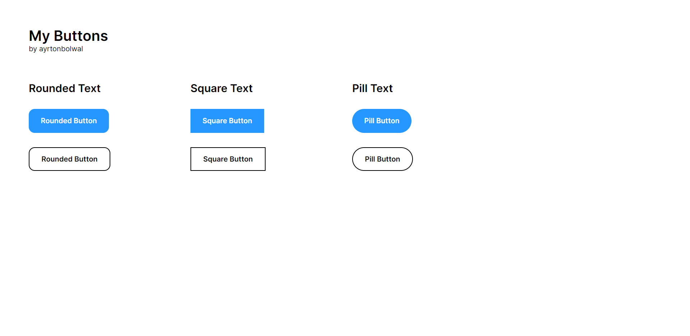

# Text Buttons

En esta carpeta podrás encontrar los text-buttons que desees, estos botones se caracterizan por tener únicamente texto en su contenido. Están listos para lo que necesites.

## Estructura

El directorio se compone por un fichero html donde se presentan los elementos de ejemplo. Las clases que necesitas para tomar un botón serían:

- btn-bw-rounded-text
- btn-bw-square-text
- btn-bw-pill-text

Cada una de estas clases se encuentra en su respectivo archivo CSS, que se compone por su dimensionamiento principal y su redimensionamiento en base a el redimensionamiento de Bootstrap. 

Las clases correspondientes a los estilos de borde, texto y color de los botones se encuentran en el archivo styles principal de la carpeta. 

Espero les sea de mucha ayuda este conjunto de botones diseñado en base a diseño UI profesional. 

Happy Coding! 👾🖖

Atte. @ayrtonbolwal

---

Otras contenidos:

[Figma Buttons and Elements Collection](https://www.figma.com/file/76iTc50t3hgFIYYhqY1wKz/Components?type=design&node-id=0%3A1&mode=design&t=fINTGcTI6VhLhwHU-1)
